# TIL_22.01.25~26

## GUI vs CLI

`GUI`: Graphic User Interface로 그래픽을 통해 사용자와 컴퓨터가 상호작용하는 방식을 말함, 즉 사용자가 마우스로 직접 폴더를 클릭하고 옮기고 지우고 등을 함

- 사람이 직접 상호작용이 되는 모습을 볼 수 있어서 쉽고 직관적이지만 컴퓨터의 성능을 많이 소모함

`CLI`: Command Line Interface로 터미널을 통해 사용자와 컴퓨터가 상호작용하는 방식을 말함, 즉 터미널이라는 검정색 창에 특정 명령어를 사용해 수행함

- 명령어을 공부해야되지만 GUI에서 할 수 없는 세부적인 기능들을 할 수 있음


## gitbash 명령어

* start . : 사용폴더를 열어줌
* open . : 사용폴더를 열어줌
* pwd: 현재 경로를 알려줌
* date: 날짜, 시간
* ~: 루트, 홈 디렉토리
* ls: list segments의 약자로 현재 디렉토리 내의 폴더와 파일들의 목록을 보여줌
* ls -a: all로 숨긴 폴더와 파일들도 보여줌
* ls -l: 폴더들의 자세한 내용을 보여줌, 언제 만들어졌는지 권한이 있는지 없는지 등
* touch: 파일 만들기 ex) touch a.txt b.txt c.txt #여러 텍스트파일 만들어줌
* mkdir: make director로 폴더 만들기, 이름에 띄어쓰기를 넣고 싶으면” ”안에다가 폴더 이름을 써야됨
  *  ex) mkdir test  #test라는 폴더가 만들어짐, mkdir “test test”
* cd: 홈폴더로 바로 가줌
* cd: change directory로 절대경로 혹은 상대경로로 폴더 안으로 들어가고 나올 수 있음 
  * ex) cd test/ #상대경로 들어가기
* cd .: 현재 위치를 열기
  * cd ..: 현재 위치에서 상대 경로로 열기 즉, 그 폴더의 상위 폴더로 가기
* mv: 파일 이동과 이름 바꾸기가 가능 
  * ex) mv a.txt b.txt # a.txt라는 텍스트파일 이름을 b.txt로 바꿈 
  * ex) mv b.txt test2/ # b.txt를 test2라는 폴더 안에 넣기
* rm: remove로 영구적으로 삭제하기,  **사용할때 경로 확인 및 주의하기** 
  * ex) rm. b.txt #파일 삭제
* rm. -r: 폴더 영구적으로 삭제,  **사용할때 경로 확인 및 주의하기** 
  * ex) rm -r test2 #test2라는 폴더 삭제
* rm -rf: 숨겨진 폴더도 같이 영구적으로 삭제,  **사용할때 경로 확인 및 주의하기** 
* rm -rf *: 강제적으로 모든 폴더를 영구적으로 삭제,  **사용할때 경로 확인 및 주의하기** 
* *: all의라는 뜻 
  * ex) rm *.txt #txt로 되어 있는 파일을 모두 삭제하라
* code .: 현재 있는 폴더 전체를 vscode로 열어줌

> 나만의 주의사항
>
> > 파일과 폴더라는 명칭 헷갈리지 말기
> >
> > 현재 경로 항상 확인하기
> >
> > rm명령어 주의해서 사용하기

### 단축 키

ctrl+l: 스크롤 내리기, 화면을 깨긋하게 보여줌

clear: 명령들을 다 지워줌

화살표 ↑: 최근 기입한 명령어들을 볼 수 있음

ctrl+a: 커서가 앞으로 이동

ctrl+e: 커서가 뒤로 이동

ctrl+w: 커서 앞 단어 삭제

ctrl+휠: 크기 키우기

ctrl+d: 루프에 갇힌 경우 빠져나오기

---

## VSCode를 사용한 git 기초

### git 명령어

> githib랑은 관련없고 내 컴퓨터안에서 일어나기 때문에 인터넷이 필요없음
>
> 변경사항이 있을 때마다 저장하는거 잊지말기

- git init: initiation으로 현재 디렉토리를 깃이 관리하는 폴더로 만들기, 최초 처음 한번만 사용해야함, 현재 디렉토리 안에 있는 폴더를 모두 관리하기 때문에 홈 폴더에서 기입하면 안됨
  - git init을 완료하면 (master)가 떠야됨                                                                                                      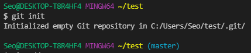

- git add 파일이름: a.txt파일을 staging area로 옮기기

  - git add .: 현재위치에서 변경사항 있는 모든 파일들을 staging area로 옮기기

- git rm --cached 파일이름:  새로운 파일을 add한 것을 다시 내리고 싶을 때 사용

  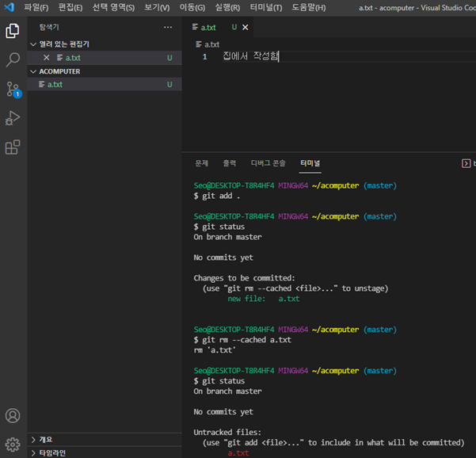 

- git restore --staged 파일이름: 수정(modified)한 것을 add했을 경우 다시 내리고 싶을 때 사용

- git commit -m "메세지": staging area에 있는 파일의 변경 사항을 하나의 버전으로 저장(local repository로 옮겨짐

- git commit --amend: 커밋 메세지를 잘못 기입한 경우 사용, 빔 에디터가 생김(목차에 빔 에디터가 생길 경우로 가서 보기)

- git config --global --list로 깃허브 아이디랑 이메일이 지정되어있는지 확인 가능                 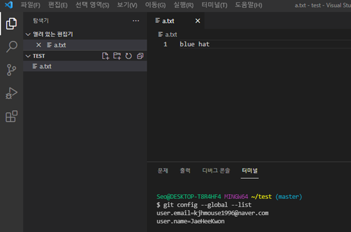         
  - 없을 경우
    - git config --global user.email "이메일"
    - git config --global user.name "본인 아이디"
  - 잘못 기입했을 경우 
    - git config --global --unset user.name로 지우고 다시 기입 가능
    - git config --global --unset user.email로 지우고 다시 기입 가능

- git status: 현 상태을 보여줌, 즉 파일의 버전관리 상황을 알려줌

  - 상태

    - untracted(git이 관리하지 않은 상태)                                                                         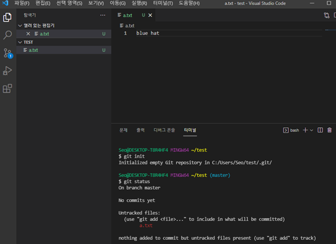   

      a.txt 옆에 있는 u가 untracted라는 뜻, git status를 찍어봤을 때도 Untracted files라고 터미널에 출력되어 있음

    - tracked(Git이 관리하는 파일)

      1. unmodified(수정되지 않은 파일임을 알려줌)

      2. modified(수정된 파일이지만 staging area에 반영하지 않은 상태)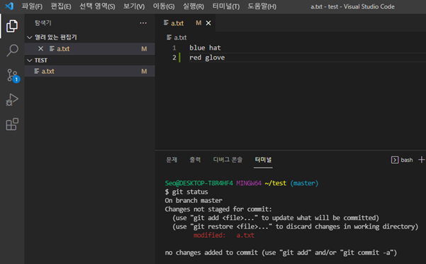

         a.txt옆에 M이 Modified라는 뜻, git status를 찍어봤을 때도 modified: a.txt라는 것을  볼 수 있음

      3. staged(staging area에 올라간 상태)                                                            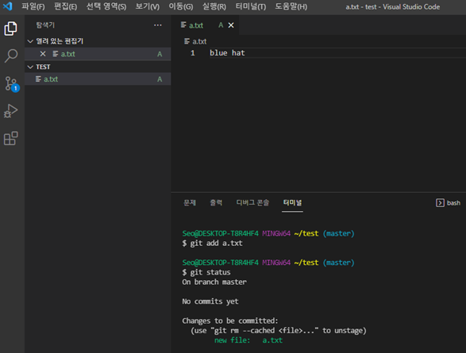

         git add a.txt를 했더니 a.txt옆에 A라고 써져있는 것을 볼 수 있고   staged라  는 뜻으로 staging area에 들어 있다는 것, git status라고 쳤을 때도 committed라고도 뜸

    - nothing to commit, working tree clean(깨끗하다)                                             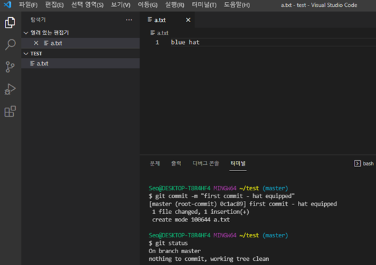

      git commit -m으로 local repository에 올라가게 된 상태


- git log: 버전들을 확인해줌, local repository에 저장된 것만 확인할 수 있음                       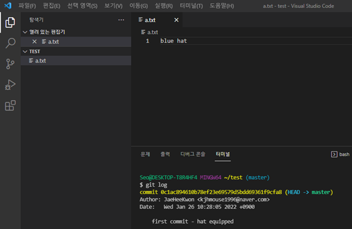 

  commit 뒤에 있는 숫자와 알파벳들의 조합은 해쉬값으로 고유 번호같은 개념


- git log --oneline: --oneline은 옵션 중 하나로 해쉬값과 함께 git log를 한줄로 간략하게 정리해줌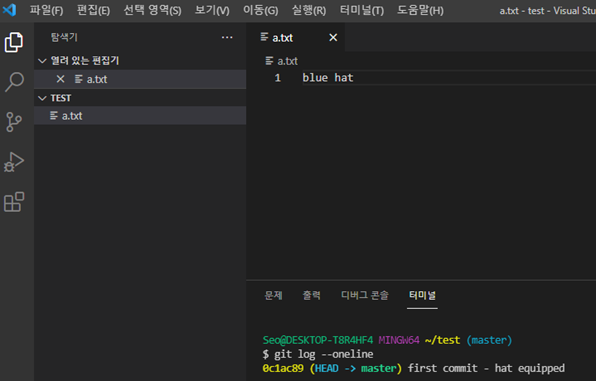

- git log –oneline --graph

- git checkout 해쉬값: 해쉬값 전까지의 작업으로 돌아가줌                                     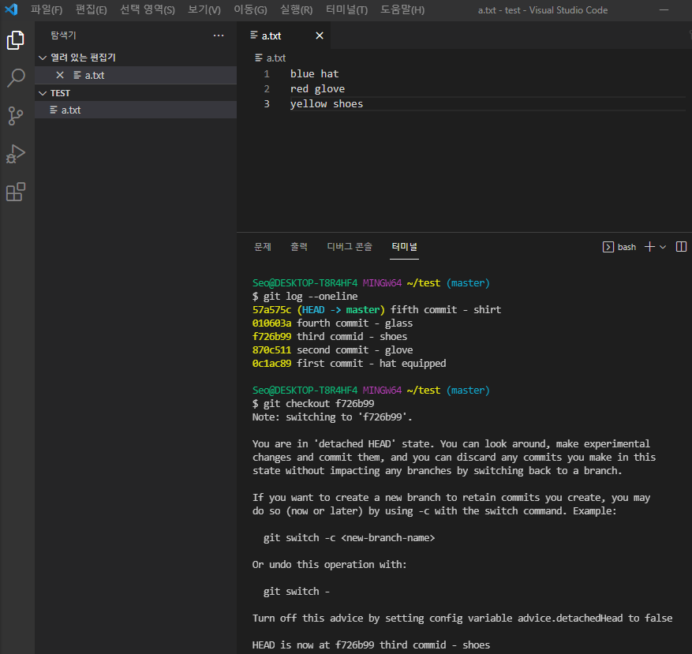

- git checkout head~숫자: head에서부터 돌아가고 싶은 작업까지의 개수를 지정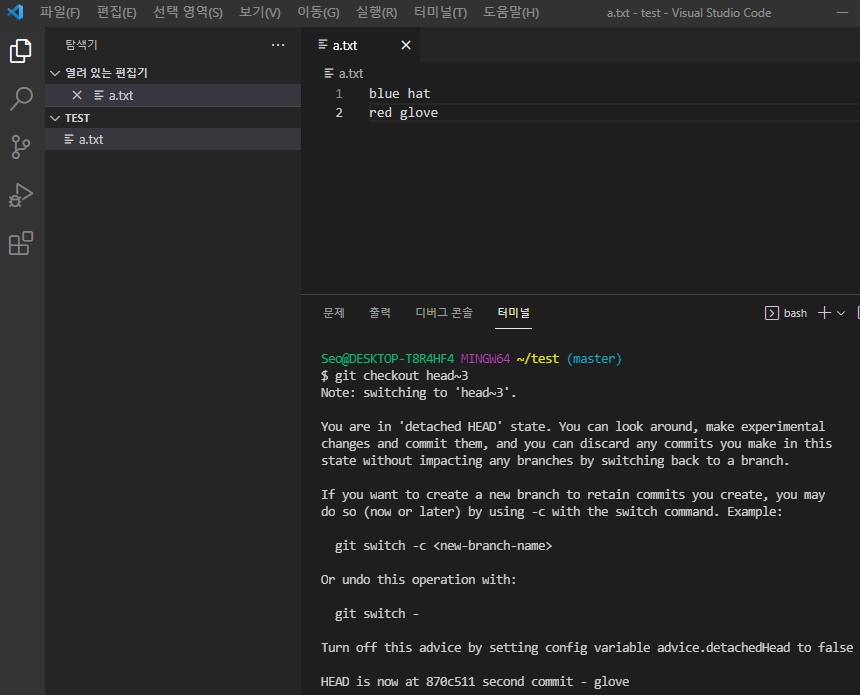

- git checkout master: 지운 것을 되돌려줌(복구)                        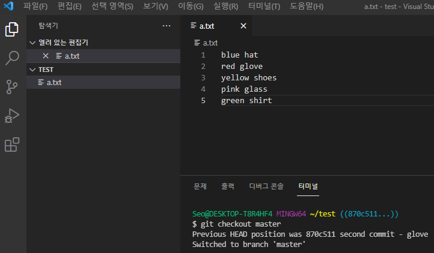

- git diff 해쉬값 해쉬값등: 파일의 어떤 내용이 변경(수정)되었는지 비교해줌

  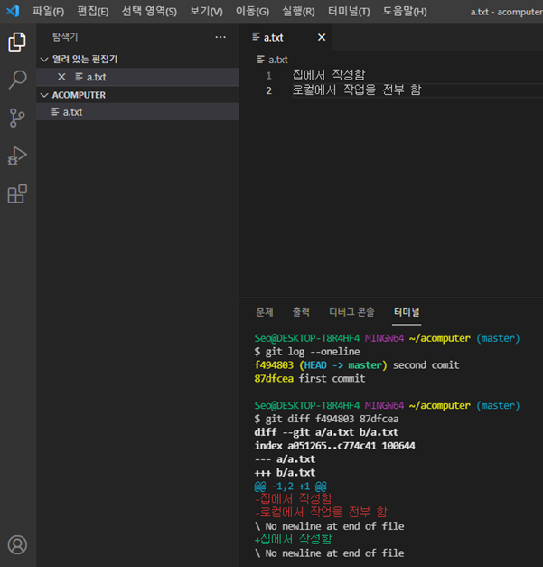 

- git remote add origin github주소: 브릿지 잇기로 본인이 만든 파일을 올리려는 github페이지에 연결시키는 것

  - git remote -v: 브릿지가 제대로 이어졌는지 확인해줌, 원격 저장소 조회                                                            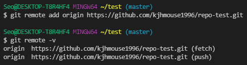
  - git remote remove origin: 깃허브주소를 잘못 기입했을 경우 연결 삭제

- git push origin master: github페이지에 올리기                                                                                            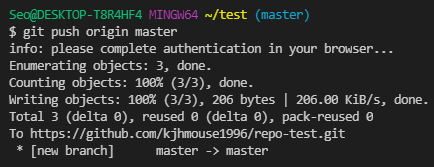

- git pull origin master: 깃허브페이지에 있는 변경사항을 그대로 로컬 저장소로 가져와서 업데이트

- touch .gitignore: .gitignore를 만들어서 깃허브에 올리기 싫은 특정 파일이나 폴더를 안에 넣을 수 있음, git add .를 했을 때 올리고 싶지 않은 것들도 전체를 add할 수 있게 해줌, 프로젝트마다 하나씩 만들어주는 것이 좋음                                             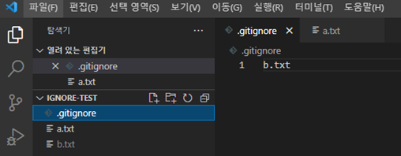


    - https://www.toptal.com/developers/gitignore에서 본인이 사용하는 언어에 맞춰 ignore해줘야되는걸 해줌


### git이 local에서 기본적으로 운영되는 방식

- 3가지 공간으로 나누어서 버전 관리를함
  
  1. working directory(working tree): 사용자의 일반적인 작업이 일어나는 곳, 대기실 같은 공간
     - git add a.txt
  2. staging area(index): 변경사항(커밋)을 위한 파일 및 폴더가 추가되는 곳, 무대같은 공간
     - git commit -m "메세지"
  3. local repository: staging area에 있던 파일 및 폴더의 변경사항(커밋)을 저장하는 곳, 무대에 있던 한 상황을 사진 찍어 사진을 저장하는 공간
  
- 새로운 변경사항, 추가사항이 있을 경우 git add랑 git commit -m을 계속 반복함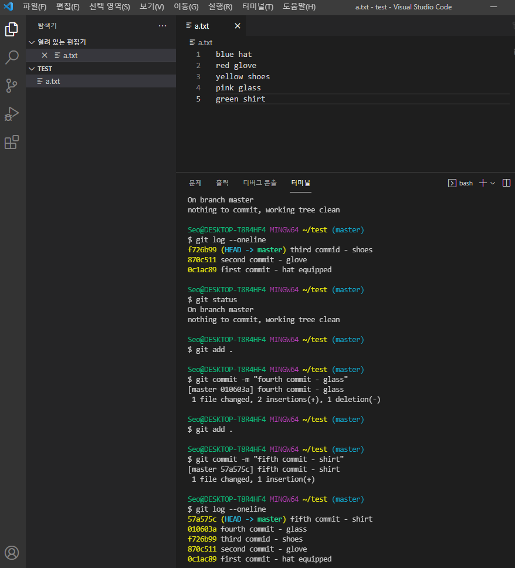
  
  git log --oneline을 치면 5개의 추가 사항이 쌓인 것을 볼 수 있음

### 빔 에디터가 생길 경우

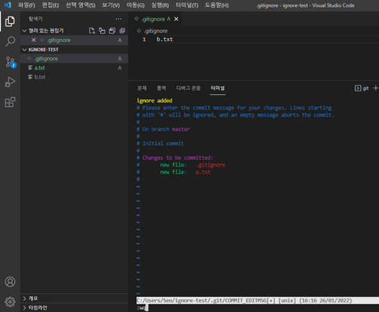 

1. 키보드에서 i를 침
2.  끼워넣기가 보이면 뒤에 이어서 적어야될 내용 적음(노란색글씨)
3.  esc누르고 :wq를 써주면됨
   - wq: write and quit

### 혼자 Clone 만들어서 사용해보기

1. 깃허브에서 repository(원격저장소)를 만들 때 옵션들을 추가해서 만들고 그 주소를 복사해 옴

3. 디렉토리 안에 폴더를 만듦 ex) TIL-home

4. 폴더 하나(TIL-home)에서 vscode를 열고 

   ``` bash
   $ git init
   $ touch day1.md
   $ git add .
   $ git commit -m "집에서 day1작성"
   $ git remote add origin 원격저장소주소
   $ git push origin master
   ```


4. clone을 만들어줌

   - git clone 클론주소: 클론 주소를 가져와서 클론 폴더(TIL-class)를 만들어주기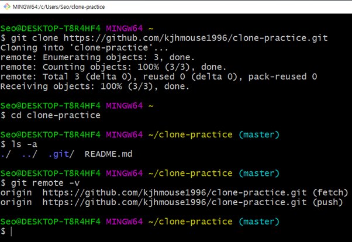
   - 클론을 만들면 바로 init이 저절로 되어 있는 것을 볼 수 있음
   - 옵션으로 README.md추가를  했던 것이 폴더 안에 있는 것을 볼 수 있음
   - 깃허브 주소도 알아서 들어가있는 것을 볼 수 있음

   

   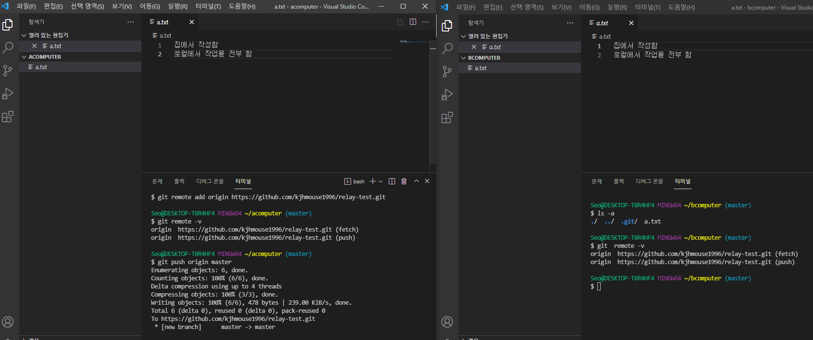

5. 클론을 만든 폴더(TIL-class)에서 vscode를 열고 새로운 파일을 만들어서 원격저장소에 올려놓기

   ```bash
   $ touch day2.md
   $ git add .
   $ git commit -m "강의장에서 Day2 작성"
   $ git push origin master
   ```

   

6. TIL-home의 vscode에서 git pull origin master를 사용해서 TIL-class폴더에서 새로 만든 파일을 가져옴

   
   
   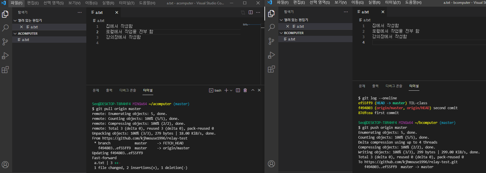

---

## 마크다운 명령어

ctr+/: 오른쪽 개요 열고 닫기 및 원문을 볼 수 있음

\#, ##, ###, …

\>: 인용구문, 주석, 여러 개 하면 들여쓰기가 됨

---: 구분 선을 그어줌

*,- : 글머리 기호할 때 사용 **∙**이렇게 나옴, 그 이후는 tab으로 하위 항목 생성 가능

\` `: 안에다가 글을 쓰면 인라인 블록으로 처리됨, 소따음표랑 헷갈리지 말것

\```: 3개를 치코 사용할 언어이름을 치면 코드를 쓸 수 있음 ex) \```python

: 링크가 있는 사진 가져오기, 사진을 ctrl+c ctrl+v로 가져올수있음

\[보여질제목](실제링크): 웹페이지 넣을 수 있음

\*글자*: 기울기

\**글자**: 굵게

\~~글자~~: 글자위에 선그어짐

\<span style='color:red'> 글자 </span> 색상 변경 가능

\|칼럼이름|칼럼이름|칼럼이름| : 표를 만들 수 있게 해줌, ctrl +t로도 똑같이 가능

- 표에서 ctrl+enter를 하면 행을 추가할 수 있음

window+. : 이모티콘 삽입 가능

### 마크다운 갖고 놀기

(ctrl+/를 하면 마크다운 문법을 볼 수 있음)

> 일반 텍스트 형식 구문
>
> > 안에 또 넣을 수 있음

1. 순서가 있는 
2. 목록
- 순서가  
  - 없는
    - 목록

`안녕하세요`

```python
for i in range(10):
	print(i)
```


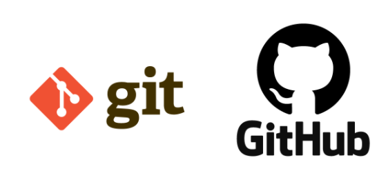


[git 공식문서](https://git-scm.com/)


*기울기*

**굵게**

~~취소~~


---

| working directory | stating area | remoe repo |
| ----------------- | ------------ | ---------- |
| working tree      | ✔            | 🎈          |
| 1                 |              |            |
| 2                 |              |            |
| 3                 |              |            |

### Python

**1. 개요**


파이썬(Python)은 1990년 암스테르담의 귀도 반 로섬(Guido Van Rossum)이 개발한 인터프리터 언어이다. 귀도는 파이썬이라는 이름을 자신이 좋아하는 코미디 쇼인 "몬티 파이썬의 날아다니는 서커스(Monty Python’s Flying Circus)"에서 따왔다고 한다.

> 인터프리터 언어란 한 줄씩 소스 코드를 해석해서 그때그때 실행해 결과를 바로 확인할 수 있는 언어이다

**2. 특징**
   1. **파이썬은 인간다운 언어이다. 아래 코드는 쉽게 해석된다**

      ``` python
      if 4 in [1,2,3,4]: print("4가 있습니다")
      ```

      *만약 4가 1,2,3,4 중에 있으면 '4가 있습니다'를 출력한다.* 라고 말이다.

   2. **파이썬은 간결하다.**

      ```python
      #simple.py
      languages = ['python', 'perl', 'c', 'java']
      
      for lang in languages:
      	if lang in ['python', 'perl']:
      		print("%6s need interpreter" % lang)
      	elif lang in ['c', 'java']:
      		print("%6s need compiler" % lang)
           else:
      		print("should not reach here")
      ```

3. 공식문서가 자세히 제공된다.

   [파이썬 공식문서 링크](https://docs.python.org/3/)

   


