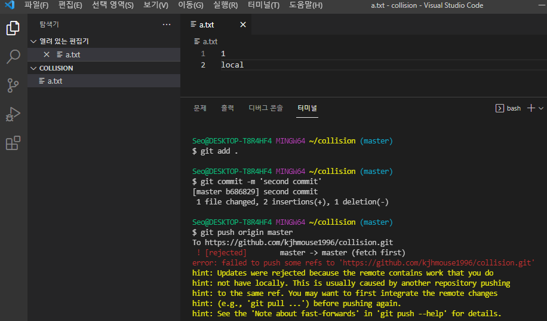
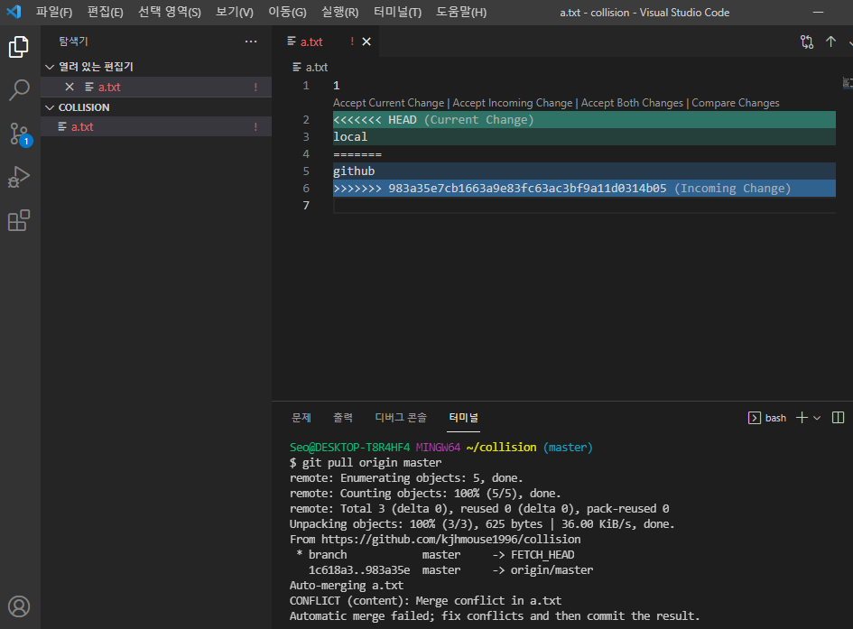
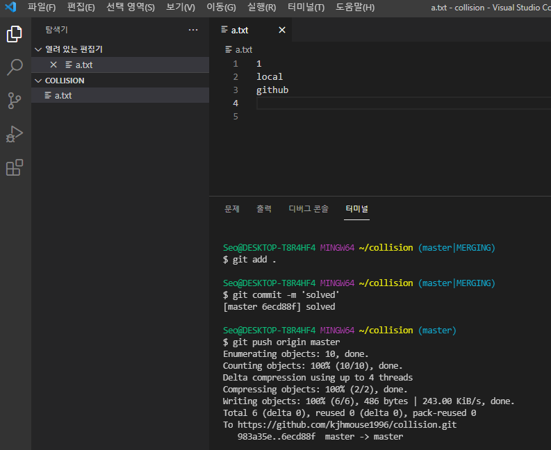
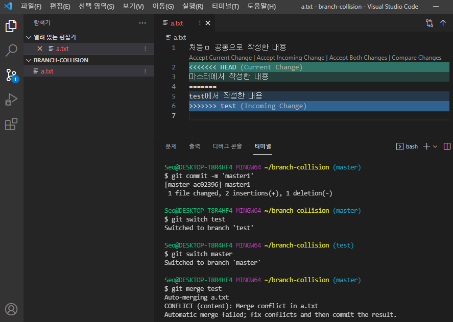
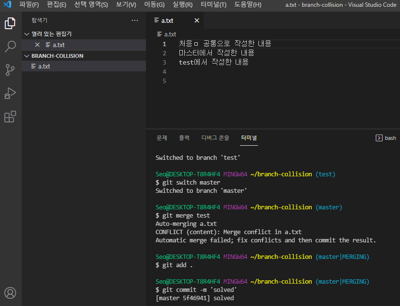
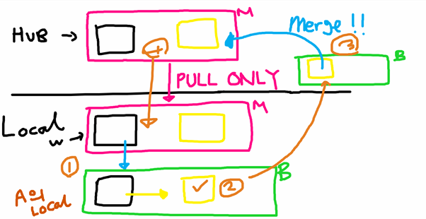
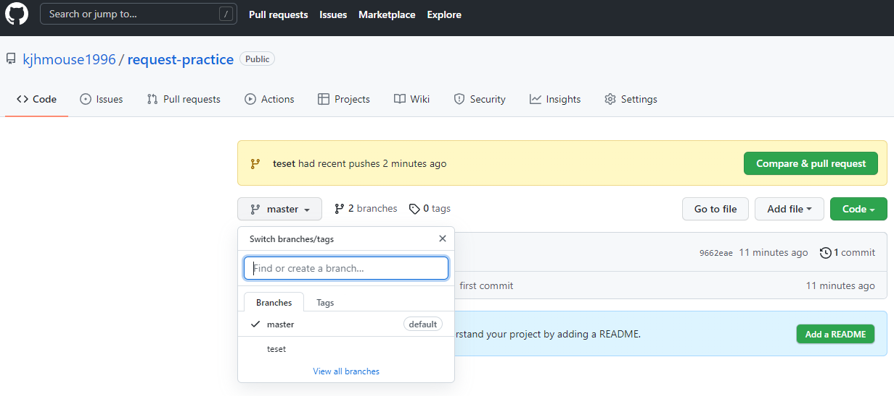
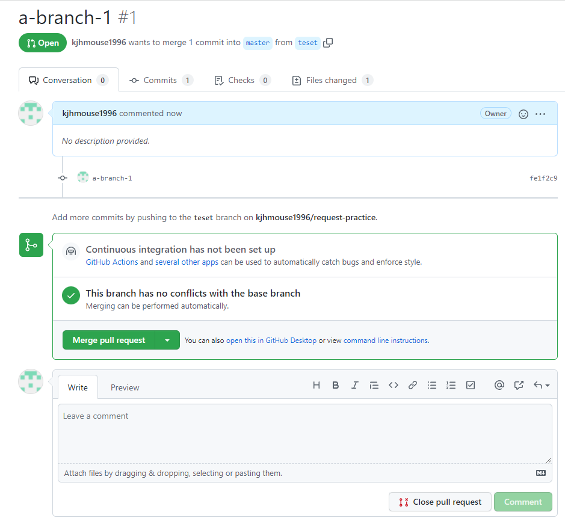
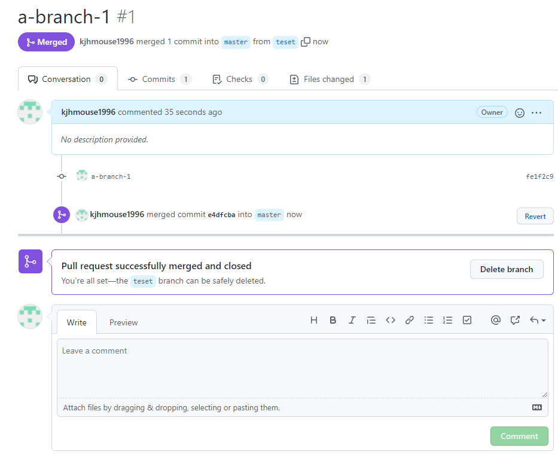

# TIL _22.01.27

## 충돌(collision) 해결하기

> online 원격저장소에서 수정한 경우 발생 가능
>
> 같은 파일을 2명 이상 수정할 경우 발생 가능

  

1. 수정한 내용을 push를 못해서 에러가 발생하여 pull로 깃허브 repository에 있는 자료를 가져옴

   ```bash
   $ git pull origin master
   ```

​        

2. <<<<<< HEAD, ======, >>>>>> 983a35e7cb166...으로 되어 있는 것을 백스페이스(backspace)로 지움

3. ctrl+s저장

4. ```bash
   $ git . add
   $ git commit -m 'solved' 
   ```

​	     


## 브랜치(branch)

> \-   branch란 독립적으로 어떤 작업을 진행하기 위한 개념으로 각각 필요에 의해 만들어진 브랜치는 다른 브랜치의 영향을 받지 않기 때문에 여러 작업을 동시에 진행할 수 있게 해줌
>
> \-    master branch란 주 브랜치로 처음 커밋했을 때 만들어짐 main branch라고도 함


### 브랜치(branch) 관련 명령어

- git branch: branch의 여부를 알려줌
- git branch 브랜치명: 새로운 브랜치의 이름을 지정해주고 만들어주기
- git switch 브랜치명(=git checkout 브랜치명): 원하는 브랜치로 이동
- git switch -c 브랜치명: 새로운 브랜치를 만들면서 새로운 브랜치로 이동
- git merge 브랜치명: 마스터에 합치고 싶은 브랜치 합치기
- git branch -d 브랜치명: 브랜치 삭제
- git branch -D 브랜치명: 브랜치 강제 삭제

### 브랜치(branch) 충돌

> local 내에서 발생하는 충돌 다룸
>
> 브랜치를 병합(merge)하려고 할때 발생 가능
>
>   \-   master branch에서 수정하고 new branch에서도 수정한 것을 서로 합치려고할 때(merge) 발생

 

1.  <<<< HEAD, >>>>>> test, ====== 부분을 백스페이스(backspace)로  지움

2.   ctrl+s저장

3. ```bash 
   $ git . add
   $ git commit -m 'solved'
   ```

   - git add . , git commit -m '새로운 메시지'를 하면 충돌이 해결되면서 master branch에 merge가 제대로 됨 

​             

## PULL REQUEST 해보기

 

1.  hub에 있는 master branch는 처음 가져올 경우 클론, 그 이후는 pull만 사용해서 local에 가져옴

   ```bash
   $ git clone 클론주소
   ```

   ```bash
   $ git pull origin master
   ```

   

2. hub에서 가져온 클론에서 작업할 새로운 branch 생성

   ```bash
   $ git branch teset
   ```

   - 본인의 local branch에서 작업함

3. 본인의 branch에서 작업한 branch를 hub의 master branch가 아닌 hub의 branch에 올림

   - 본인의 branch와 hub의 branch 이름을 맞춰줘야됨 

     ```bash
     $ git push origin teset
     ```

      

     hub에 master branch 뿐만 아니라  teset branch도 추가된 것을 볼 수 있음

4.  hub의 branch를 hub의 master branch에다가 merge를 하는데 이를 팀원들한테 요청하는 것이 pull request 혹은 merge request라고 함

   - hub페이지에 'Compare & pull request' 버튼을 누르기

   ​        

   - 'Merge pull request' 버튼을 누르면 hub의 master branch에 merge됨

   ​      

      'Delete branch' 버튼을 누르면 hub의 master branch에 merge하려고 임시로 만든 hub의 branch를 삭제함, 삭제해도 다시 복구 가능